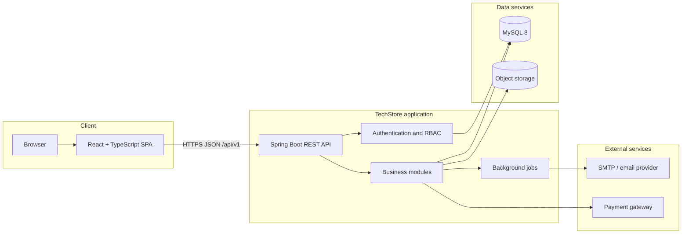
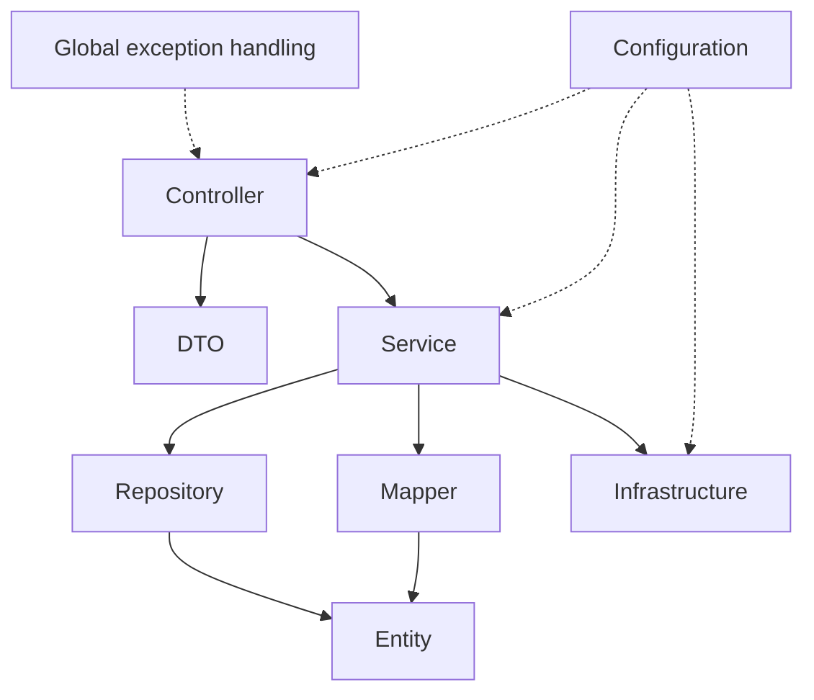
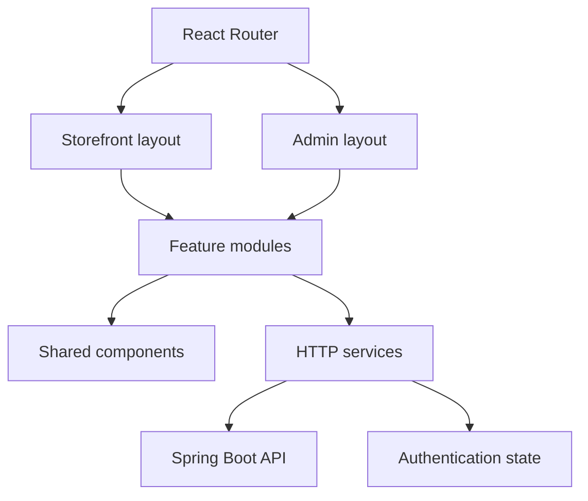
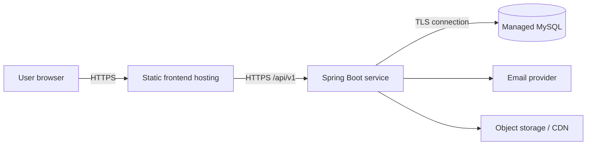

# TechStore system architecture

**Story:** `US-00.2`
**Tasks:** `T-00.2.1`, `T-00.2.2`, `T-00.2.3`

## 1. Mục tiêu kiến trúc

TechStore là ứng dụng thương mại điện tử gồm storefront cho khách hàng và khu
vực quản trị cho nhân viên. Kiến trúc ban đầu ưu tiên triển khai đơn giản, giao
dịch dữ liệu nhất quán và cấu trúc đủ rõ để phát triển các module nghiệp vụ độc
lập trong cùng một codebase.

Hệ thống được triển khai theo mô hình client–server:

- React single-page application chịu trách nhiệm giao diện và trạng thái phía
  trình duyệt.
- Spring Boot cung cấp REST API, xác thực, phân quyền và xử lý nghiệp vụ.
- MySQL lưu dữ liệu giao dịch.
- Dịch vụ SMTP gửi email; object storage lưu ảnh sản phẩm. Các tích hợp bên
  ngoài luôn đi qua abstraction trong tầng infrastructure.

## 2. Sơ đồ kiến trúc tổng thể

Luồng request chính:

1. Người dùng thao tác trên SPA.
2. HTTP client gọi `/api/v1`, gắn access token với request cần xác thực.
3. Controller xác thực input và chuyển xử lý sang service.
4. Service thực thi rule nghiệp vụ trong transaction và truy cập repository.
5. Repository làm việc với MySQL qua Spring Data JPA.
6. Controller trả về envelope `ApiResponse`; lỗi được chuyển đổi tập trung bởi
   `GlobalExceptionHandler`.

## 3. Kiến trúc Backend

Backend là modular monolith sử dụng kiến trúc phân lớp. Chiều phụ thuộc chuẩn:

| Thành phần | Trách nhiệm |
|---|---|
| `controller` | HTTP endpoint, status code và request/response DTO |
| `service` | Use case, transaction và business rule |
| `repository` | Truy vấn và lưu entity |
| `entity` | Mô hình persistence và quan hệ dữ liệu |
| `dto` | Contract đầu vào/đầu ra, không trả entity trực tiếp |
| `mapper` | Chuyển đổi entity ↔ DTO |
| `exception` | Business exception và ánh xạ lỗi tập trung |
| `config` | CORS, OpenAPI, security và bean dùng chung |
| `infrastructure` | Database probe, email, storage và adapter ngoài hệ thống |

Các module nghiệp vụ Auth, Catalog, Inventory, Cart, Order, Review, Voucher và
Admin dùng chung các layer trên trong giai đoạn đầu. Khi codebase lớn hơn, các
package có thể được nhóm theo module nhưng vẫn giữ nguyên chiều phụ thuộc.

## 4. Kiến trúc Frontend

Frontend tổ chức theo module nghiệp vụ và dùng component/layout dùng chung:

- `modules`: page và logic theo tính năng.
- `components`: UI có thể tái sử dụng.
- `layouts`: khung storefront và admin.
- `routers`: route table và route guards.
- `services`: Axios instance và API client theo module.
- `configs`, `constants`, `types`, `utils`: cấu hình và primitive dùng chung.

Frontend không chứa business rule quyết định giá, tồn kho hoặc trạng thái đơn
hàng. Những rule này được Backend kiểm tra lại kể cả khi giao diện đã validate.

## 5. Stack công nghệ đã chốt

| Khu vực | Công nghệ | Vai trò |
|---|---|---|
| Backend | Java 21, Spring Boot 3.4, Maven | REST API và build |
| Persistence | Spring Data JPA, Hibernate | ORM và transaction |
| Database | MySQL 8.0+; MySQL 8.4 là môi trường tham chiếu | Dữ liệu giao dịch |
| API documentation | springdoc-openapi / Swagger UI | Sinh OpenAPI tự động |
| Backend test | JUnit 5, Spring Boot Test, H2 MySQL mode | Unit/integration test |
| Frontend | React 19, TypeScript 5, Vite 7 | SPA và build |
| Routing/API | React Router 7, Axios | Điều hướng và HTTP client |
| UI | Material UI 7, Emotion | Component và theme thống nhất |
| Frontend test | Vitest, Testing Library, jsdom | Component và integration test |
| CI | GitHub Actions | Lint, test và build trên Pull Request |

Lý do và hệ quả của các lựa chọn được ghi tại:

- [ADR-0001: Technology stack](adr/0001-technology-stack.md)
- [ADR-0002: Layered modular monolith](adr/0002-layered-modular-monolith.md)

## 6. Dữ liệu và giao dịch

- MySQL là source of truth cho tài khoản, catalog, tồn kho, giỏ hàng và đơn hàng.
- Schema chi tiết nằm trong [DATABASE_DESIGN.md](DATABASE_DESIGN.md).
- Thao tác tạo đơn, giữ/trừ tồn kho và sử dụng voucher phải nằm trong transaction.
- Order item và địa chỉ giao hàng được lưu dạng snapshot để lịch sử không đổi khi
  dữ liệu nguồn được cập nhật.
- Mốc thời gian lưu ở UTC; Backend chịu trách nhiệm chuyển đổi khi hiển thị.

## 7. API và tích hợp ngoài

- REST JSON được version bằng prefix `/api/v1`.
- Response thành công và lỗi sử dụng `ApiResponse` thống nhất.
- OpenAPI JSON ở `/api-docs`, Swagger UI ở `/swagger-ui.html`.
- Email và storage sử dụng interface/adapter để có thể thay nhà cung cấp mà không
  đổi service nghiệp vụ.
- Timeout, retry và idempotency phải được cấu hình cho payment/email/storage khi
  các integration này được triển khai.

## 8. Bảo mật và vận hành

- Production chỉ phục vụ qua HTTPS.
- Secret được truyền qua biến môi trường, không commit file `.env`.
- Backend là nơi thực thi cuối cùng đối với authentication và RBAC; frontend
  guard chỉ hỗ trợ trải nghiệm người dùng.
- Log không chứa mật khẩu, token hoặc dữ liệu thanh toán nhạy cảm.
- CORS chỉ cho phép các origin được cấu hình.
- Profile `dev`, `test`, `prod` tách datasource và mức log.
- Health endpoint kiểm tra cả ứng dụng và kết nối database.

## 9. Môi trường triển khai

Ở local, frontend chạy cổng `5173`, backend chạy cổng `8080` và kết nối MySQL
qua `DB_URL`, `DB_USERNAME`, `DB_PASSWORD`. Test Backend dùng H2 ở MySQL mode để
CI không phụ thuộc database bên ngoài.

## 10. Các quyết định cần ADR mới

Tạo ADR mới trước khi thay đổi một trong các quyết định sau: database chính,
kiểu kiến trúc triển khai, cơ chế authentication/session, nhà cung cấp payment,
message broker, chiến lược lưu trữ ảnh hoặc framework UI.
