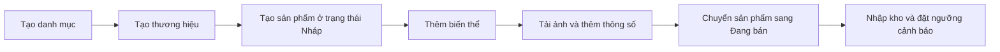
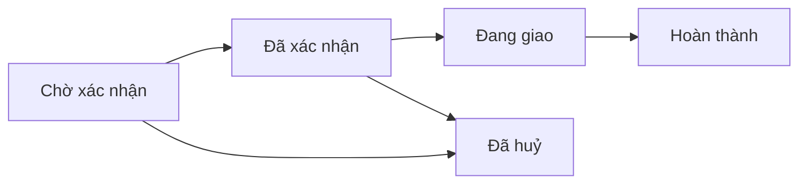

# US-15.4 — Hướng dẫn sử dụng hệ thống quản trị

| Thông tin | Giá trị |
| --- | --- |
| Tên tài liệu | Admin User Manual — Đăng Tùng Mobile |
| Phiên bản | 1.0 |
| Ngày cập nhật | 18/09/2026 |
| Đối tượng sử dụng | Quản trị viên và nhân sự vận hành cửa hàng |
| Phạm vi | Khu vực quản trị của phiên bản bàn giao sau US-15.3 |
| User Story | US-15.4 |
| Task | T-15.4.1, T-15.4.2, T-15.4.3 |

## 1. Mục đích và cách đọc tài liệu

Tài liệu này hướng dẫn người vận hành sử dụng khu vực quản trị mà không cần kiến
thức kỹ thuật. Nội dung bao phủ toàn bộ các chức năng chính: danh mục, thương
hiệu, sản phẩm, tồn kho, đơn hàng, dashboard và báo cáo. Các chức năng hỗ trợ như
người dùng, đánh giá, mã giảm giá, khuyến mãi và thông báo cũng được mô tả để
Admin có thể vận hành hệ thống hằng ngày.

Trong các phần hướng dẫn:

- Chữ **in đậm** là tên menu, nút hoặc trường đúng như trên giao diện.
- Mỗi quy trình có các bước thao tác và kết quả mong đợi.
- Các sơ đồ là hình minh họa luồng nghiệp vụ; dữ liệu, số lượng và tên sản phẩm
  thực tế sẽ thay đổi theo cửa hàng.
- Không ghi tài khoản, mật khẩu, access token hoặc thông tin máy chủ vào tài liệu.

## 2. Chuẩn bị trước khi sử dụng

Admin cần:

1. URL HTTPS của hệ thống do đơn vị bàn giao cung cấp.
2. Tài khoản có vai trò **ADMIN** đang ở trạng thái hoạt động.
3. Trình duyệt Chrome, Edge hoặc Firefox phiên bản mới.
4. Kết nối mạng ổn định.

Đường dẫn đăng nhập quản trị có dạng:

`https://<ten-mien-duoc-ban-giao>/admin/login`

Không dùng trang đăng nhập khách hàng tại `/login` để đăng nhập quản trị. Không
đăng nhập nếu trình duyệt báo chứng chỉ HTTPS không hợp lệ.

> **Khuyến nghị:** dùng máy tính để thao tác các bảng dữ liệu và xuất báo cáo.
> Trên điện thoại, nhấn biểu tượng menu ở góc trên để mở điều hướng quản trị.

## 3. Bản đồ khu vực quản trị

| Menu | Đường dẫn | Mục đích |
| --- | --- | --- |
| **Tổng quan** | `/admin` | Xem KPI, doanh thu, trạng thái đơn và sản phẩm bán chạy |
| **Người dùng** | `/admin/users` | Tìm kiếm, khoá hoặc mở khoá tài khoản |
| **Danh mục** | `/admin/categories` | Quản lý cây danh mục và thứ tự hiển thị |
| **Thương hiệu** | `/admin/brands` | Quản lý thông tin thương hiệu |
| **Sản phẩm** | `/admin/products` | Quản lý sản phẩm, biến thể, ảnh và thông số |
| **Tồn kho** | `/admin/inventory` | Nhập kho, điều chỉnh, cảnh báo và lịch sử kho |
| **Đơn hàng** | `/admin/orders` | Tra cứu và xử lý vòng đời đơn hàng |
| **Đánh giá** | `/admin/reviews` | Duyệt, ẩn hoặc hiện nhận xét của khách hàng |
| **Mã giảm giá** | `/admin/vouchers` | Quản lý voucher dùng tại checkout |
| **Khuyến mãi** | `/admin/promotions` | Quản lý giảm giá trực tiếp theo thời gian |
| **Báo cáo doanh thu** | `/admin/reports/revenue` | Xem và xuất doanh thu theo ngày |
| **Báo cáo sản phẩm** | `/admin/reports/products` | Xem sản phẩm bán chạy và tồn kho thấp |

Luồng vận hành catalog được khuyến nghị:

## 4. Đăng nhập, điều hướng và đăng xuất

### 4.1 Đăng nhập

1. Mở đường dẫn `/admin/login`.
2. Nhập **Email quản trị viên**.
3. Nhập **Mật khẩu**.
4. Nhấn **Đăng nhập Quản trị**.
5. Khi thành công, hệ thống chuyển đến **Dashboard tổng quan**.

Kết quả mong đợi: góc trên hiển thị họ tên và nhãn **Quản trị viên**. Nếu tài
khoản không có vai trò ADMIN, hệ thống từ chối truy cập dù email và mật khẩu đúng.

### 4.2 Điều hướng

- Trên máy tính, chọn chức năng từ thanh menu bên trái.
- Trên màn hình nhỏ, nhấn **Mở điều hướng quản trị**, sau đó chọn menu.
- Nhấn **Về cửa hàng** để mở storefront.
- Biểu tượng chuông ở thanh trên cùng hiển thị số thông báo chưa đọc.

### 4.3 Thông báo đơn hàng

1. Nhấn biểu tượng chuông.
2. Chọn một thông báo chưa đọc để đánh dấu đã đọc và mở chi tiết đơn liên quan.
3. Chọn **Đọc tất cả** để đánh dấu toàn bộ thông báo hiện tại đã đọc.

### 4.4 Đăng xuất

1. Hoàn tất hoặc huỷ các biểu mẫu đang mở.
2. Nhấn **Đăng xuất**.
3. Đóng trình duyệt nếu đang dùng máy tính dùng chung.

## 5. Dashboard tổng quan

Dashboard giúp Admin theo dõi nhanh hoạt động cửa hàng.

1. Chọn **Tổng quan**.
2. Tại **Khoảng xem**, chọn:
   - **Theo ngày** để xem một ngày;
   - **Theo tuần** để xem bảy ngày của tuần đã chọn;
   - **Theo tháng** để xem một tháng.
3. Chọn ngày, tuần hoặc tháng tương ứng.
4. Dữ liệu được tải lại; có thể nhấn **Làm mới** khi cần.

Các vùng thông tin:

- **Tổng doanh thu**;
- **Tổng số đơn hàng**;
- số nhóm **Trạng thái đơn hàng** có phát sinh;
- biểu đồ **Doanh thu theo thời gian**;
- **Đơn hàng theo trạng thái**;
- **Sản phẩm bán chạy nhất** theo số lượng và doanh thu.

Trong dashboard, **Tổng doanh thu** là tổng giá trị các đơn không bị huỷ trong
khoảng xem, không phải chỉ số doanh thu kế toán đã đối soát thanh toán.

Nếu xuất hiện lỗi tải dữ liệu, nhấn **Thử lại**. Không cộng thủ công các số liệu
ở nhiều khoảng thời gian vì phạm vi ngày có thể giao nhau.

## 6. Quản lý danh mục và thương hiệu

### 6.1 Tạo danh mục

1. Chọn **Danh mục**.
2. Nhấn **Thêm danh mục**.
3. Nhập **Tên danh mục**.
4. Chọn **Danh mục cha (Tuỳ chọn)** nếu đây là danh mục con; để trống nếu là
   danh mục gốc.
5. Có thể nhập **Đường dẫn ảnh đại diện (URL)** và **Mô tả danh mục**.
6. Nhấn nút lưu trong hộp thoại.

Kết quả mong đợi: danh mục xuất hiện đúng cấp trong cây danh mục.

### 6.2 Sửa, sắp xếp và ẩn/hiện danh mục

- Nhấn biểu tượng sửa ở dòng cần thay đổi, cập nhật thông tin rồi lưu.
- Thay đổi số thứ tự hiển thị và rời khỏi ô nhập để hệ thống lưu thứ tự mới.
- Dùng công tắc hiển thị để chuyển giữa **Đang hiện** và **Đang ẩn**.
- Danh mục ẩn không còn xuất hiện trong điều hướng storefront nhưng vẫn được giữ
  trong dữ liệu quản trị.

### 6.3 Xoá danh mục

1. Nhấn biểu tượng xoá ở danh mục lá.
2. Kiểm tra tên danh mục trong hộp thoại.
3. Nhấn xác nhận xoá.

Không thể xoá danh mục đang có danh mục con hoặc còn được sản phẩm sử dụng. Hãy
chuyển sản phẩm/danh mục con sang vị trí khác trước.

### 6.4 Quản lý thương hiệu

1. Chọn **Thương hiệu**.
2. Dùng ô tìm kiếm để kiểm tra thương hiệu đã tồn tại hay chưa.
3. Nhấn **Thêm thương hiệu**.
4. Nhập tên; có thể nhập URL logo và mô tả.
5. Lưu và kiểm tra thương hiệu trong bảng.

Để cập nhật hoặc xoá, dùng biểu tượng tương ứng tại dòng thương hiệu. Không thể
xoá thương hiệu đang được sản phẩm tham chiếu.

## 7. Quản lý sản phẩm

### 7.1 Tạo sản phẩm cơ bản

Điều kiện: danh mục và thương hiệu cần được tạo trước.

1. Chọn **Sản phẩm**.
2. Nhấn **Thêm sản phẩm**.
3. Nhập **Tên sản phẩm**. Tên không được trùng trong cùng một thương hiệu.
4. Chọn **Thương hiệu** và **Danh mục**.
5. Chọn **Nháp (DRAFT)** tại **Trạng thái ban đầu**. Sản phẩm mới chưa có biến
   thể nên hệ thống sẽ từ chối nếu cố tạo trực tiếp ở trạng thái ACTIVE.
6. Nhập **Mô tả sản phẩm**.
7. Nhấn **Tạo sản phẩm**.

Kết quả mong đợi: sản phẩm xuất hiện trong bảng. Dùng ô
**Tìm kiếm sản phẩm theo tên, thương hiệu, danh mục...** để tìm lại.

### 7.2 Sửa thông tin và trạng thái

- Nhấn **Sửa** để thay tên, thương hiệu, danh mục, trạng thái hoặc mô tả.
- Nhấn chip trạng thái trong bảng để đổi nhanh:
  - **Nháp (DRAFT):** chưa hiển thị bán;
  - **Đang bán (ACTIVE):** hiển thị trên storefront;
  - **Ngừng bán (INACTIVE):** tạm dừng bán.
- Sản phẩm chỉ có thể chuyển sang **Đang bán** khi có ít nhất một biến thể hợp lệ.

### 7.3 Quản lý biến thể

Mỗi tổ hợp màu sắc/dung lượng nên là một biến thể riêng.

1. Tại dòng sản phẩm, nhấn **Biến thể**.
2. Nhấn **Thêm biến thể**.
3. Nhập **Mã SKU** duy nhất; hệ thống tự viết hoa.
4. Nhập **Màu sắc** và **Dung lượng / Phiên bản** nếu có.
5. Nhập **Giá bán (VNĐ)**.
6. Nếu có giá niêm yết, nhập **Giá gốc (VNĐ)**; giá gốc phải lớn hơn hoặc bằng
   giá bán.
7. Nhập **Số lượng tồn kho** ban đầu và chọn trạng thái biến thể.
8. Lưu và kiểm tra dòng vừa tạo.

Sau khi sản phẩm đi vào vận hành, dùng menu **Tồn kho** để nhập hoặc điều chỉnh
số lượng nhằm giữ lịch sử giao dịch kho. Biến thể đã phát sinh đơn hàng có thể
không được phép xoá; chọn **Ngừng bán / Tạm ẩn** thay vì xoá.

### 7.4 Quản lý hình ảnh

1. Tại dòng sản phẩm, nhấn **Hình ảnh**.
2. Chọn **Gán vào biến thể** hoặc để **Ảnh chung**.
3. Bật **Đặt ảnh đầu tiên làm ảnh đại diện** nếu phù hợp.
4. Kéo thả ảnh vào vùng tải lên hoặc nhấp để chọn file.
5. Chờ thông báo tải lên thành công.

Quy định file:

- định dạng JPG, JPEG, PNG hoặc WEBP;
- tối đa 5 MB mỗi file;
- nên dùng ảnh rõ, cùng tỷ lệ và không chứa thông tin nhạy cảm.

Trong danh sách ảnh:

- nhấn **Đặt đại diện** để chọn ảnh chính;
- đổi trường **Biến thể** để gắn ảnh với biến thể khác;
- nhấn biểu tượng xoá và xác nhận để xoá ảnh.

Xoá ảnh là thao tác không thể hoàn tác. Nếu xoá ảnh đại diện, hệ thống tự chọn
ảnh kế tiếp làm ảnh đại diện.

### 7.5 Quản lý thông số kỹ thuật

1. Tại dòng sản phẩm, nhấn **Thông số**.
2. Nhấn **Thêm thông số**.
3. Chọn một gợi ý nhanh hoặc nhập **Tên thông số kỹ thuật**.
4. Nhập **Giá trị thông số**.
5. Nhập **Thứ tự hiển thị**; số nhỏ hơn xuất hiện trước.
6. Nhấn **Thêm thông số**.

Tên thông số không được trùng trong cùng một sản phẩm. Dùng biểu tượng sửa hoặc
xoá tại từng dòng khi cần cập nhật.

### 7.6 Xoá sản phẩm

1. Kiểm tra đúng tên sản phẩm.
2. Nhấn **Xoá**.
3. Đọc cảnh báo và xác nhận.

Hệ thống dùng cơ chế xoá mềm để bảo toàn lịch sử. Sản phẩm đã liên quan tới đơn
hàng có thể bị chặn xoá; khi đó hãy chuyển trạng thái sang **Ngừng bán**.

## 8. Quản lý tồn kho

### 8.1 Hiểu các con số tồn kho

| Cột | Ý nghĩa |
| --- | --- |
| **Tồn thực tế** | Tổng số lượng hiện có trong kho |
| **Đang giữ** | Số lượng đang được giữ cho đơn hàng chưa kết thúc |
| **Khả dụng** | Tồn thực tế trừ số đang giữ; đây là số có thể tiếp tục bán |
| **Ngưỡng cảnh báo** | Mức dùng để xác định biến thể sắp hết hàng |

Các thẻ đầu trang hiển thị **Tổng biến thể**, **Còn hàng**, **Sắp hết hàng** và
**Hết hàng**. Nhấn thẻ **Sắp hết hàng** hoặc **Hết hàng** để chuyển nhanh tới
tab cảnh báo.

### 8.2 Tra cứu tồn kho

1. Chọn **Tồn kho** rồi mở tab **Danh sách tồn kho**.
2. Tìm theo tên sản phẩm hoặc SKU.
3. Chọn danh mục và **Trạng thái tồn** nếu cần.
4. Nhấn **Lọc**.
5. Kiểm tra SKU, thuộc tính, khả dụng, đang giữ, tồn thực tế và ngưỡng.
6. Nhấn biểu tượng đặt lại để xoá bộ lọc.

### 8.3 Nhập hàng mới

Dùng **Nhập kho** khi hàng thực tế vừa được nhập từ nhà cung cấp.

1. Tìm đúng biến thể rồi nhấn **Nhập kho** ngay tại dòng đó. Nút ở đầu trang chỉ
   nên dùng khi Admin đã xác định chắc biến thể cần chọn.
2. Kiểm tra lại biến thể/SKU trong hộp thoại.
3. Nhập **Số lượng nhập** lớn hơn 0.
4. Nhập ghi chú về nhà cung cấp, chứng từ hoặc đợt nhập nếu cần.
5. Kiểm tra số **Dự kiến sau nhập**.
6. Nhấn **Xác nhận nhập kho**.
7. Kiểm tra thông báo thành công và số tồn mới.

### 8.4 Điều chỉnh sau kiểm kê

Dùng **Điều chỉnh kho** để sửa chênh lệch kiểm kê, hàng hỏng hoặc thất thoát;
không dùng thay cho một đợt nhập hàng thông thường.

1. Tìm đúng biến thể rồi nhấn **Điều chỉnh** ngay tại dòng đó. Có thể dùng
   **Điều chỉnh kho** ở đầu trang khi cần chọn biến thể từ danh sách.
2. Kiểm tra lại biến thể/SKU.
3. Chọn một phương thức:
   - **Nhập số lượng lệch (+ / -):** số dương để tăng, số âm để giảm;
   - **Nhập tồn thực tế kiểm kê:** nhập con số đếm được, hệ thống tự tính lệch.
4. Kiểm tra **Tồn dự kiến sau điều chỉnh** và **Khả dụng dự kiến**.
5. Chọn gợi ý hoặc nhập **Lý do điều chỉnh (bắt buộc)**.
6. Nhấn **Xác nhận điều chỉnh**.

Hệ thống không cho phép tồn thực tế âm hoặc thấp hơn số lượng đang giữ. Nếu gặp
cảnh báo này, đối chiếu các đơn đang xử lý trước khi điều chỉnh.

### 8.5 Cảnh báo và ngưỡng tồn thấp

1. Mở tab **Cảnh báo tồn kho**.
2. Tìm theo tên/SKU hoặc lọc danh mục.
3. Chọn **Nhập kho** để bổ sung hàng ngay.
4. Chọn thao tác cấu hình ngưỡng tại biến thể cần thay đổi.
5. Nhập **Ngưỡng cảnh báo tồn kho thấp** từ 0 trở lên.
6. Nhấn **Lưu cấu hình**.

Biến thể được cảnh báo khi khả dụng nhỏ hơn hoặc bằng ngưỡng.

### 8.6 Xem lịch sử kho

1. Mở tab **Lịch sử nhập kho**.
2. Chọn **Tất cả**, **Nhập kho** hoặc **Điều chỉnh**.
3. Kiểm tra thời gian, sản phẩm/SKU, loại giao dịch, số lượng thay đổi, người
   thực hiện và ghi chú.

Lịch sử là căn cứ kiểm tra; không sửa trực tiếp giao dịch cũ. Nếu sai, tạo giao
dịch điều chỉnh mới với lý do rõ ràng.

## 9. Quản lý đơn hàng

### 9.1 Tìm đơn hàng

1. Chọn **Đơn hàng**.
2. Nhập mã đơn, tên khách hàng hoặc số điện thoại tại **Tìm kiếm**.
3. Có thể chọn trạng thái, **Từ ngày** và **Đến ngày**.
4. Nhấn **Lọc đơn hàng**.
5. Nhấn **Đặt lại** để trở về danh sách đầy đủ.
6. Nhấn **Xem chi tiết** tại đúng đơn.

### 9.2 Kiểm tra chi tiết trước khi xử lý

Đối chiếu:

- mã đơn và thời gian đặt;
- khách hàng và số điện thoại;
- phương thức/trạng thái thanh toán;
- sản phẩm, SKU, phân loại, số lượng và đơn giá;
- giảm giá, phí vận chuyển và tổng thanh toán;
- địa chỉ giao hàng;
- ghi chú nội bộ và lịch sử trạng thái.

Không cập nhật trạng thái nếu thông tin giao nhận chưa được xác minh.

### 9.3 Chuyển trạng thái đơn

| Trạng thái hiện tại | Thao tác hợp lệ |
| --- | --- |
| **Chờ xác nhận** | **Xác nhận đơn hàng** hoặc **Huỷ đơn hàng** |
| **Đã xác nhận** | **Chuyển sang đang giao** hoặc **Huỷ đơn hàng** |
| **Đang giao** | **Hoàn thành đơn hàng** |
| **Hoàn thành / Đã huỷ** | Trạng thái cuối, không cập nhật thêm |

Các bước:

1. Trong **Chi tiết đơn hàng**, tới vùng **Cập nhật trạng thái**.
2. Chọn **Trạng thái mới**.
3. Kiểm tra lại lựa chọn.
4. Nhấn **Cập nhật trạng thái**.
5. Chờ thông báo **Đã cập nhật trạng thái đơn hàng**.
6. Kiểm tra **Lịch sử trạng thái** có thời gian và người thực hiện.

### 9.4 Huỷ đơn

1. Chỉ huỷ đơn ở trạng thái **Chờ xác nhận** hoặc **Đã xác nhận**.
2. Chọn **Huỷ đơn hàng**.
3. Nhập **Lý do huỷ đơn**; trường này hiển thị là tuỳ chọn nhưng nên luôn ghi để
   phục vụ đối soát.
4. Nhấn **Cập nhật trạng thái**.
5. Kiểm tra trạng thái **Đã huỷ**, lý do huỷ và lịch sử.
6. Kiểm tra lại tồn kho; hệ thống tự hoàn số lượng đã giữ/trừ theo nghiệp vụ huỷ.

Không yêu cầu khách tạo lại đơn trước khi xác nhận thao tác huỷ đã thành công.

## 10. Báo cáo

### 10.1 Báo cáo doanh thu

1. Chọn **Báo cáo doanh thu**.
2. Chọn **Từ ngày** và **Đến ngày**; ngày kết thúc không được trước ngày bắt đầu
   và không được ở tương lai.
3. Nhấn **Xem báo cáo**.
4. Kiểm tra:
   - **Tổng doanh thu**;
   - **Tổng số đơn hàng**;
   - **Giá trị đơn trung bình**;
   - bảng **Chi tiết doanh thu theo ngày**.

Đơn đã huỷ không được tính vào báo cáo.

Chỉ số **doanh thu** tại đây là tổng giá trị mọi đơn không bị huỷ trong khoảng
ngày, kể cả đơn chưa hoàn tất hoặc chưa thanh toán. Khi đối soát kế toán, cần
kiểm tra thêm trạng thái đơn và trạng thái thanh toán.

Để tải file:

1. Chờ báo cáo hiển thị thành công.
2. Nhấn **Xuất Excel**.
3. Chờ trình duyệt hoàn tất tải xuống.
4. Mở file và kiểm tra đúng khoảng ngày trước khi gửi hoặc lưu trữ.

File Excel chứa dữ liệu kinh doanh; chỉ chia sẻ cho người có thẩm quyền.

### 10.2 Báo cáo sản phẩm và tồn kho

1. Chọn **Báo cáo sản phẩm**.
2. Chọn **Từ ngày**, **Đến ngày**.
3. Chọn danh mục hoặc **Tất cả danh mục**.
4. Chọn cách **Sắp xếp top bán chạy** theo số lượng, doanh thu hoặc tên.
5. Nhấn **Xem báo cáo**.
6. Đọc hai vùng:
   - **Top sản phẩm bán chạy:** sản phẩm, danh mục, số lượng bán, doanh thu;
   - **Sản phẩm tồn kho thấp:** biến thể, SKU, khả dụng, ngưỡng và trạng thái.

Dùng kết quả để lập kế hoạch nhập kho. Nhấn **Đặt lại** để trở về bộ lọc mặc
định. Bảng top bán chạy theo khoảng ngày và không tính đơn đã huỷ; bảng tồn kho
thấp phản ánh tồn hiện tại nên không phụ thuộc khoảng ngày đã chọn.

## 11. Các chức năng quản trị hỗ trợ

### 11.1 Người dùng

1. Chọn **Người dùng**.
2. Tìm theo họ tên hoặc email rồi nhấn **Tìm kiếm**.
3. Kiểm tra vai trò và trạng thái.
4. Nhấn **Khoá** hoặc **Mở khoá**, sau đó xác nhận.

Admin không thể tự khoá tài khoản đang đăng nhập. Chỉ khoá khi đã xác minh đúng
người dùng và lý do vận hành.

### 11.2 Đánh giá

1. Chọn **Đánh giá**.
2. Lọc theo **Chờ duyệt**, **Đã duyệt** hoặc **Đã ẩn**.
3. Đọc điểm sao và nội dung nhận xét.
4. Chọn **Duyệt**, **Ẩn** hoặc **Hiện**.

Chỉ ẩn nội dung vi phạm quy định; không chỉnh sửa nội dung khách hàng.

### 11.3 Mã giảm giá

1. Chọn **Mã giảm giá** rồi nhấn **Tạo voucher**.
2. Nhập mã, tên và chọn loại giảm phần trăm hoặc số tiền cố định.
3. Nhập giá trị giảm, đơn tối thiểu và mức giảm tối đa nếu dùng phần trăm.
4. Đặt tổng lượt dùng, lượt dùng mỗi khách, thời gian bắt đầu/kết thúc.
5. Chọn **Đang kích hoạt** và nhấn **Lưu**.

Thời gian kết thúc phải sau thời gian bắt đầu. Voucher đã có lịch sử sử dụng
không thể xoá; hãy tắt kích hoạt nếu không muốn tiếp tục áp dụng.

### 11.4 Khuyến mãi trực tiếp

1. Chọn **Khuyến mãi** rồi nhấn **Tạo chương trình**.
2. Nhập tên và chọn phạm vi: sản phẩm, biến thể hoặc danh mục.
3. Chọn đối tượng áp dụng.
4. Nhập mức giảm phần trăm và thời gian hiệu lực.
5. Chọn **Đang kích hoạt** rồi lưu.

Nếu nhiều chương trình cùng có hiệu lực cho một biến thể, hệ thống áp dụng mức
giảm phần trăm cao nhất. Xoá chương trình làm giá hiển thị trở về giá không có
chương trình đó.

## 12. Xử lý sự cố thường gặp

| Hiện tượng | Cách xử lý |
| --- | --- |
| Báo sai email/mật khẩu | Kiểm tra Caps Lock, nhập lại; không thử liên tục quá nhiều lần |
| Báo không có quyền | Đăng xuất và dùng tài khoản ADMIN; liên hệ người quản lý quyền |
| Phiên đăng nhập hết hạn | Đăng nhập lại tại `/admin/login` |
| Danh sách không tải | Nhấn **Thử lại** hoặc **Làm mới**; kiểm tra mạng |
| Lưu biểu mẫu thất bại | Đọc thông báo đỏ, sửa trường được chỉ ra rồi gửi lại một lần |
| Không xoá được dữ liệu | Kiểm tra quan hệ với sản phẩm, biến thể hoặc đơn hàng |
| Không kích hoạt được sản phẩm | Thêm ít nhất một biến thể hợp lệ rồi thử lại |
| Không giảm được tồn kho | Tồn dự kiến không được âm hoặc thấp hơn số đang giữ |
| Không xuất được Excel | Chờ báo cáo tải xong, cho phép trình duyệt tải file rồi thử lại |
| Số liệu vừa thao tác chưa đổi | Nhấn **Làm mới** và kiểm tra thông báo kết quả/lịch sử |

Với thao tác có ảnh hưởng dữ liệu như nhập kho, điều chỉnh kho hoặc cập nhật đơn,
không nhấn lặp lại khi màn hình đang hiển thị **Đang lưu/Đang cập nhật**. Nếu mất
mạng giữa chừng, tải lại danh sách hoặc lịch sử để xác định thao tác đã được ghi
nhận trước khi thực hiện lại.

## 13. Quy tắc vận hành an toàn

- Không chia sẻ tài khoản; mỗi Admin dùng tài khoản riêng.
- Không lưu mật khẩu trên máy dùng chung và luôn đăng xuất cuối ca.
- Không gửi token, ảnh chụp thông tin đăng nhập hoặc file cấu hình cho người khác.
- Kiểm tra tên sản phẩm/SKU/mã đơn trước mọi thao tác thay đổi.
- Luôn ghi lý do rõ ràng cho điều chỉnh tồn kho và huỷ đơn.
- Ưu tiên ẩn/ngừng bán thay vì xoá dữ liệu đã phát sinh giao dịch.
- Chỉ mở file xuất báo cáo trên thiết bị được phép lưu dữ liệu kinh doanh.
- Khi thấy lỗi lặp lại, ghi thời gian, màn hình, bước thao tác và nội dung thông
  báo để gửi bộ phận kỹ thuật; không gửi mật khẩu hoặc token.

## 14. Checklist cuối ca

- [ ] Các đơn mới đã được kiểm tra và xử lý đúng trạng thái.
- [ ] Đơn huỷ có lý do và tồn kho đã được đối chiếu.
- [ ] Cảnh báo sắp hết/hết hàng đã được xem.
- [ ] Các điều chỉnh kho có ghi chú đầy đủ.
- [ ] Voucher/khuyến mãi hết hạn đã được kiểm tra trạng thái.
- [ ] Báo cáo cần bàn giao đã dùng đúng khoảng ngày.
- [ ] Đã đăng xuất khỏi hệ thống quản trị.

## 15. Đối chiếu phạm vi US-15.4

| Task | Nội dung đáp ứng |
| --- | --- |
| T-15.4.1 | Mục 6–8: danh mục, thương hiệu, sản phẩm, biến thể, ảnh, thông số và tồn kho |
| T-15.4.2 | Mục 9–10: quản lý đơn hàng, vòng đời trạng thái, báo cáo và xuất Excel |
| T-15.4.3 | Tài liệu hoàn chỉnh, có sơ đồ, hướng dẫn theo bước, lưu trong `docs/` và được liên kết từ README |

## 16. Tài liệu liên quan

- [Triển khai production](US-15.3-deployment.md)
- [Cấu hình môi trường production](US-15.2-environment.md)
- [Kiến trúc hệ thống](ARCHITECTURE.md)
- [Thiết kế cơ sở dữ liệu](DATABASE_DESIGN.md)
