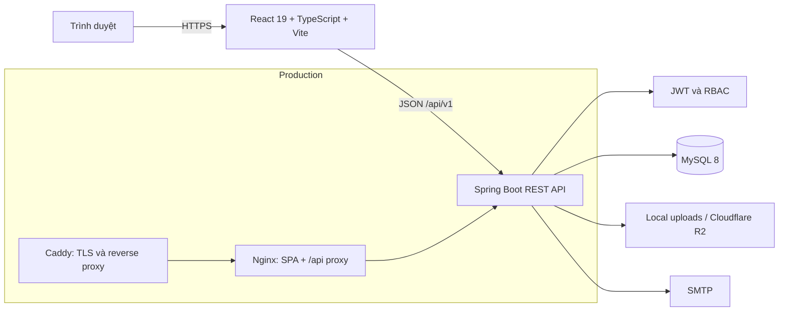
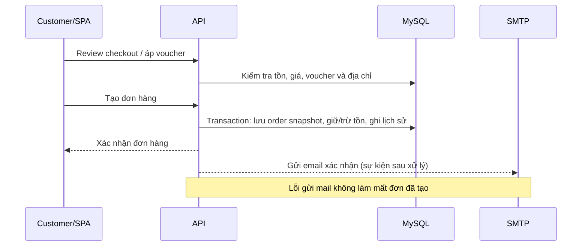

# US-15.5 — Tài liệu kỹ thuật bàn giao

> **Dự án:** Đăng Tùng Mobile
> **Phiên bản tài liệu:** 1.0
> **Cập nhật:** 18/09/2026
> **Phạm vi:** `T-15.5.1`, `T-15.5.2`, `T-15.5.3`

## 1. Mục đích và phạm vi

Tài liệu này giúp người tiếp nhận cài đặt, chạy, kiểm tra và triển khai Đăng
Tùng Mobile mà không cần suy đoán cấu trúc hoặc cấu hình của dự án. Hệ thống là
website thương mại điện tử cho phụ kiện điện thoại, gồm storefront cho khách
hàng và khu vực quản trị cho `ADMIN`.

Tài liệu mô tả trạng thái mã nguồn hiện tại. Thông tin vận hành dành cho người
dùng quản trị nằm tại [Admin User Manual](US-15.4-admin-user-manual.md); đây là
tài liệu dành cho người phát triển và vận hành kỹ thuật.

## 2. Tổng quan kiến trúc



- **Frontend:** một React single-page application. React Router điều hướng
  storefront và admin; Axios gọi API; Material UI cung cấp component và theme.
- **Backend:** một _modular monolith_ Spring Boot REST API. Controller nhận HTTP,
  service thực hiện use case/transaction, repository truy cập MySQL qua JPA.
- **Dữ liệu:** MySQL là nguồn dữ liệu chính. Flyway quản lý migration trong
  `backend/src/main/resources/db/migration`.
- **Tích hợp:** SMTP gửi email; ảnh dùng filesystem ở `dev`/`test` và Cloudflare
  R2 ở profile `prod`.

### 2.1 Luồng request

1. Trình duyệt tải SPA và gọi API dưới prefix `/api/v1`.
2. `httpClient` của Frontend gắn `Authorization: Bearer <access-token>` vào
   request cần xác thực.
3. Controller validate DTO rồi gọi service. Service áp dụng business rule và
   transaction; repository thao tác dữ liệu.
4. API trả `ApiResponse` thống nhất. `GlobalExceptionHandler` chuyển lỗi
   validation/nghiệp vụ thành response HTTP phù hợp.
5. Với endpoint admin, interceptor yêu cầu role `ADMIN`; route guard Frontend
   chỉ hỗ trợ UX, không thay thế phân quyền Backend.

### 2.2 Luồng nghiệp vụ trọng yếu: đặt hàng



Các hàng đơn và địa chỉ giao hàng là bản chụp tại thời điểm đặt đơn. Tồn kho có
optimistic locking và mọi biến động được ghi vào `inventory_transactions`.
Quy tắc chi tiết về bảng, khóa và ràng buộc xem tại
[DATABASE_DESIGN.md](DATABASE_DESIGN.md).

## 3. Công nghệ và các quyết định kỹ thuật

| Khu vực | Công nghệ đang dùng | Mục đích |
| --- | --- | --- |
| Backend | Java 21, Spring Boot 3.4.5, Maven Wrapper | REST API, validation, transaction |
| Persistence | Spring Data JPA/Hibernate, Flyway, MySQL 8.0.16+ | ORM, migration, dữ liệu giao dịch |
| Authentication | JWT (`jjwt`), BCrypt, RBAC | Xác thực và phân quyền |
| API documentation | springdoc-openapi 2.8.8, Swagger UI | Contract API tương tác |
| Frontend | React 19, TypeScript 5, Vite 7 | SPA có kiểm tra kiểu |
| UI / HTTP | Material UI 7, Axios, React Router 7 | Giao diện, gọi API, routing |
| Test | JUnit/Spring Boot Test/H2; Vitest/Testing Library/Playwright | Unit, integration và E2E |
| Build & deploy | Docker Compose, Nginx, Caddy, GitHub Actions | Đóng gói, HTTPS và CI |

Hai quyết định kiến trúc được chấp nhận và phải được tham chiếu trước khi thay
đổi lớn:

1. [ADR-0001 — Technology stack](adr/0001-technology-stack.md): chọn Java 21,
   Spring Boot, MySQL, React/TypeScript/Vite, Material UI và GitHub Actions.
2. [ADR-0002 — Layered modular monolith](adr/0002-layered-modular-monolith.md):
   giữ một deployment đơn giản, phân tầng `controller → service → repository`,
   không trả entity trực tiếp qua API và đặt adapter ngoài ở `infrastructure`.

Việc thay database chính, cơ chế session/authentication, topology microservice,
payment, storage ảnh hoặc framework UI cần ADR mới; không sửa ADR cũ để che
lịch sử quyết định.

## 4. Cấu trúc repository

```text
tech-store/
├── .github/workflows/                  # CI Backend, Frontend và Compose smoke test
├── backend/                             # Spring Boot API
│   ├── src/main/java/com/techstore/
│   │   ├── config/                      # CORS, OpenAPI, properties, storage config
│   │   ├── controller/                  # Public API và controller/admin
│   │   ├── dto/                         # Request/response contracts
│   │   ├── entity/, repository/         # JPA entity và persistence
│   │   ├── service/                     # Interface và business use case
│   │   ├── security/                    # JWT, role interceptor, security headers
│   │   ├── infrastructure/, event/      # SMTP, health/storage adapter, event listener
│   │   └── exception/, validator/, mapper/, enums/
│   ├── src/main/resources/
│   │   ├── application*.yml             # Profile dev/test/prod
│   │   └── db/migration/                # Flyway V1…V25
│   ├── src/test/                        # Unit, controller và integration test
│   ├── Dockerfile
│   └── pom.xml
├── frontend/                            # React SPA
│   ├── src/modules/                     # Page theo nghiệp vụ
│   ├── src/components/, layouts/        # Component và khung dùng chung
│   ├── src/routers/, services/          # Route guards, Axios/API clients
│   ├── src/test/                        # Vitest/Testing Library tests
│   ├── Dockerfile, nginx.conf
│   └── package.json
├── deploy/                              # Caddy Compose override và Caddyfile
├── docs/                                # Kiến trúc, DB, API, ADR, vận hành, manual
├── scripts/                             # Preflight, deploy, verify production
├── docker-compose.yml                   # MySQL + Backend + Frontend
└── .env.example                         # Mẫu runtime secret/config production
```

### 4.1 Quy tắc thay đổi mã nguồn

- Thêm endpoint: tạo DTO rõ ràng, validate input, giữ business rule trong service
  và cập nhật Swagger/API contract khi cần.
- Thay đổi schema: thêm migration Flyway mới có số tăng dần; không chỉnh sửa
  migration đã chạy trên môi trường dùng chung.
- Thay đổi Frontend: gọi API qua `services/`, không đưa rule quyết định giá,
  tồn kho hoặc trạng thái đơn vào UI.
- Không commit `.env`, khóa JWT, mật khẩu database/SMTP/R2 hay token thật.
- Mọi thay đổi đi qua Pull Request vào `develop` hoặc `main`; CI là điều kiện
  bắt buộc trước khi merge.

## 5. Cài đặt và chạy local từ đầu

### 5.1 Điều kiện cần

- Git.
- JDK 21 (`java -version`).
- MySQL Server 8.0.16 trở lên; MySQL 8.4 là môi trường tham chiếu.
- Node.js 20.19 trở lên và npm 10 trở lên (`node --version`, `npm --version`).
- Docker Engine + Compose plugin chỉ cần khi chạy stack container hoặc production.

Clone source và đứng tại thư mục gốc:

```powershell
git clone https://github.com/hoangganhh05/tech-store.git
cd tech-store
git switch develop
```

### 5.2 Khởi tạo MySQL và Backend

Tạo user/database MySQL theo chính sách máy cục bộ. Với tài khoản `root`, ví dụ
an toàn tối thiểu là:

```sql
CREATE DATABASE techstore CHARACTER SET utf8mb4 COLLATE utf8mb4_unicode_ci;
```

Mở PowerShell ở root repository, đặt biến cho **phiên terminal hiện tại** (thay
mật khẩu thật; đừng dán secret vào tài liệu hay commit):

```powershell
$env:SPRING_PROFILES_ACTIVE = "dev"
$env:DB_URL = "jdbc:mysql://localhost:3306/techstore?useUnicode=true&characterEncoding=UTF-8&serverTimezone=UTC"
$env:DB_USERNAME = "root"
$env:DB_PASSWORD = "<mysql-password>"
```

Sau đó chạy API:

```powershell
cd backend
.\mvnw.cmd spring-boot:run
```

Lần chạy đầu, Flyway áp dụng các migration trong `db/migration` để tạo schema,
role, tài khoản admin seed và dữ liệu nền tảng. Không chạy đồng thời script schema
cũ trên database đã được Flyway quản lý. Kiểm tra nhanh:

```powershell
curl.exe http://localhost:8080/api/v1/health
```

Địa chỉ local hữu ích:

| Dịch vụ | Địa chỉ |
| --- | --- |
| Health | `http://localhost:8080/api/v1/health` |
| OpenAPI JSON | `http://localhost:8080/api-docs` |
| Swagger UI | `http://localhost:8080/swagger-ui.html` |
| File upload local | `http://localhost:8080/uploads/...` |

Profile mặc định là `dev`. `test` dùng H2 MySQL mode và thư mục
`backend/target/test-uploads`; `prod` yêu cầu cấu hình database, JWT, CORS,
SMTP và R2 qua môi trường.

### 5.3 Khởi tạo Frontend

Mở terminal PowerShell thứ hai:

```powershell
cd frontend
Copy-Item .env.example .env
npm install
npm run dev
```

Frontend mở tại `http://localhost:5173`. File `.env` local cần
`VITE_API_BASE_URL=http://localhost:8080/api/v1`. Biến `VITE_*` được đóng gói
vào bundle trình duyệt nên chỉ đặt thông tin công khai; không đặt mật khẩu, JWT
secret hoặc thông tin SMTP trong đó.

### 5.4 Kiểm tra trước khi gửi Pull Request

```powershell
# Backend, tại backend/
.\mvnw.cmd test
.\mvnw.cmd verify

# Frontend, tại frontend/
npm run typecheck
npm run lint
npm test
npm run build
```

`verify` của Backend tạo JaCoCo report và kiểm tra tỷ lệ bao phủ tối thiểu 70%
cho các core service. CI trên Pull Request còn chạy Playwright E2E và Compose
smoke test; chi tiết xem [CI.md](CI.md).

## 6. Cấu hình môi trường

### 6.1 Các profile Backend

| Profile | Mục đích | Điểm khác biệt |
| --- | --- | --- |
| `dev` | Phát triển local | MySQL local, log SQL/debug, có dev JWT mặc định |
| `test` | Test tự động | H2 MySQL mode, Flyway tắt, upload vào `target/` |
| `prod` | Chạy thực tế | Validate schema, log INFO, bắt buộc DB/JWT/CORS/SMTP/R2 |

`application.yml` chọn profile qua `SPRING_PROFILES_ACTIVE` (mặc định `dev`).
Spring Boot **không tự đọc** `.env`; ở local hãy đặt terminal environment hoặc
dùng một công cụ nạp biến riêng đã được đội thống nhất.

### 6.2 Biến production quan trọng

Sao chép `.env.example` thành `.env` bí mật tại server/secret store và thay toàn
bộ giá trị mẫu. Các nhóm cần thiết:

| Nhóm | Biến chính | Lưu ý |
| --- | --- | --- |
| Runtime | `SPRING_PROFILES_ACTIVE=prod`, `SERVER_PORT` | Compose đặt Backend ở 8080 nội bộ |
| Database | `DB_URL`, `DB_USERNAME`, `DB_PASSWORD`, `MYSQL_*` | Password mạnh, không public cổng MySQL |
| Security | `JWT_SECRET`, `JWT_ACCESS_TOKEN_TTL`, `JWT_REFRESH_TOKEN_TTL` | Secret mới, ít nhất 32 ký tự, không dùng dev secret |
| Web | `CORS_ALLOWED_ORIGINS`, `PASSWORD_RESET_FRONTEND_URL` | Chỉ HTTPS origin thật, cách nhau bằng dấu phẩy, không dùng `*` |
| Email | `MAIL_HOST`, `MAIL_PORT`, `MAIL_USERNAME`, `MAIL_PASSWORD`, `MAIL_FROM` | Bắt buộc để reset password không thất bại âm thầm |
| Ảnh sản phẩm | `R2_ENDPOINT`, `R2_BUCKET_NAME`, `R2_ACCESS_KEY_ID`, `R2_SECRET_ACCESS_KEY`, `R2_PUBLIC_BASE_URL` | Profile prod ghi ảnh vào Cloudflare R2 |
| Public domain | `APP_DOMAIN`, `ACME_EMAIL` | Caddy cấp/renew TLS |

`frontend/.env.production.example` chỉ dùng khi build static Frontend tách rời.
`VITE_API_BASE_URL` phải là URL API công khai, ví dụ
`https://api.store.example.com/api/v1`. Trong Docker Compose của dự án, dùng
`/api/v1` vì Nginx proxy cùng origin đến Backend.

Hướng dẫn đầy đủ về tách secret, CORS và R2 nằm tại
[US-15.2-environment.md](US-15.2-environment.md).

## 7. Chạy và triển khai bằng Docker

### 7.1 Smoke test/stack local bằng container

Docker Compose tạo ba service: `database` (MySQL), `backend` và `frontend`.
Database/Backend chỉ ở mạng nội bộ; Frontend/Nginx là cổng được publish.

```powershell
Copy-Item .env.example .env
# Điền các biến bắt buộc trong .env bằng giá trị local hợp lệ.
docker compose up --build -d
docker compose ps
curl.exe http://localhost:8080/api/v1/health
docker compose down
```

Không dùng `docker compose down -v` trừ khi chủ động muốn xóa volume MySQL và
upload. Hướng dẫn image, health check và volume: [US-15.1-docker.md](US-15.1-docker.md).

### 7.2 Production server

Production chạy Compose kèm `deploy/docker-compose.production.yml`. Caddy sở
hữu port 80/443, redirect HTTPS và proxy vào Frontend; Nginx proxy `/api/` sang
Backend nội bộ. Không publish cổng 3306 hoặc 8080 của Backend ra Internet.

Điều kiện: VPS Linux có Docker/Compose/Git/Curl, DNS `A`/`AAAA` của `APP_DOMAIN`
đã trỏ server, firewall chỉ mở TCP 80/443 và `.env` có giá trị production thật.

```bash
git clone https://github.com/hoangganhh05/tech-store.git
cd tech-store
git switch main
cp .env.example .env
# Sửa .env trong private server secret store.
bash ./scripts/preflight-production-server.sh
bash ./scripts/deploy-production.sh
```

Lệnh deploy chỉ fast-forward `main`, từ chối checkout bẩn, chờ health check và
gọi xác minh HTTPS/health. Mỗi lần redeploy:

```bash
cd /path/to/tech-store
bash ./scripts/deploy-production.sh
bash ./scripts/verify-production.sh https://your-domain.example
```

Quy trình chi tiết và checklist external acceptance: [US-15.3-deployment.md](US-15.3-deployment.md).

## 8. API, Swagger và xác thực

Base path là `/api/v1`. Khi chạy local, mở Swagger UI tại
[`http://localhost:8080/swagger-ui.html`](http://localhost:8080/swagger-ui.html)
hoặc OpenAPI JSON tại [`http://localhost:8080/api-docs`](http://localhost:8080/api-docs).
Ở production, thay host local bằng domain HTTPS thực tế. Swagger là nguồn tra cứu
request/response DTO và validation mới nhất; [api_contract.md](api_contract.md)
ghi ví dụ contract nền tảng.

Response thành công thường dùng envelope:

```json
{
  "success": true,
  "code": "SUCCESS",
  "message": "...",
  "data": {},
  "timestamp": "2026-09-18T00:00:00Z"
}
```

Endpoint xác thực gửi `Authorization: Bearer <accessToken>`. Access token mặc
định hết hạn sau 15 phút, refresh token sau 7 ngày; TTL là biến môi trường.
Mọi endpoint `/api/v1/admin/**` (trừ admin login) yêu cầu role `ADMIN`.

### 8.1 Danh sách API chính

| Nhóm | Endpoint tiêu biểu | Mục đích / quyền |
| --- | --- | --- |
| Health | `GET /health` | Kiểm tra app/database, public |
| Auth | `POST /auth/register`, `/login`, `/admin/login`, `/logout`, `/forgot-password`, `/reset-password` | Tài khoản, phiên và reset mật khẩu |
| Storefront | `GET /storefront/home`, `/featured`, `/new-arrivals`, `/on-sale`, `/categories`, `/brands` | Dữ liệu trang chủ, public |
| Catalog | `GET /products`, `/products/search`, `/products/{id}`, `/products/{id}/related`, `/categories` | Duyệt/tìm catalog, public |
| Cart/checkout | `GET/POST/PATCH/DELETE /cart...`; `GET/POST /checkout...` | Giỏ hàng và review checkout, user/session |
| Orders | `POST /orders`, `GET /orders/my-orders`, `GET /orders/{id}`, `PATCH /orders/{id}/cancel` | Đơn của khách đã đăng nhập |
| Profile | `GET/PUT /users/me`, `/users/me/password`, `/users/me/addresses...` | Hồ sơ, mật khẩu và địa chỉ của chính user |
| Engagement | `GET/POST /products/{productId}/reviews...`; `GET/POST/DELETE /wishlist...` | Đánh giá và yêu thích |
| Admin catalog | `/admin/categories`, `/admin/brands`, `/admin/products`, variants/images/specifications | Quản trị catalog, `ADMIN` |
| Admin inventory | `/admin/inventory`, `/import`, `/adjust`, `/low-stock`, `/transactions` | Tồn kho, audit lịch sử, `ADMIN` |
| Admin orders | `GET /admin/orders`, `GET /admin/orders/{id}`, `PATCH /admin/orders/{id}/status` | Xử lý đơn, `ADMIN` |
| Admin report | `/admin/dashboard`, `/admin/reports/revenue`, `/revenue/export`, `/reports/products` | Dashboard/báo cáo, `ADMIN` |
| Admin operations | `/admin/users`, `/reviews`, `/vouchers`, `/promotions`, `/notifications` | Điều hành hệ thống, `ADMIN` |

Các path trong bảng là phần **sau** `/api/v1`. Xem HTTP method, query parameter,
request body và status code chính xác bằng Swagger trước khi tích hợp. Khi gọi
API ngoài Frontend, không tự tin vào validation phía client; Backend là nguồn
thực thi cuối cùng của rule nghiệp vụ.

## 9. Vận hành, bảo mật và xử lý sự cố

### 9.1 Checklist vận hành

- Sau deploy: kiểm tra `https://<APP_DOMAIN>/` và
  `https://<APP_DOMAIN>/api/v1/health` trả thành công.
- Xác nhận HTTP redirect sang HTTPS, có header HSTS và không public MySQL/API
  port trực tiếp.
- Theo dõi `docker compose ps` và `docker compose logs --follow backend` khi
  điều tra lỗi; không ghi token hoặc password vào ticket/log chia sẻ.
- Sao lưu MySQL và đánh giá khả năng khôi phục trước upgrade lớn. Volume uploads
  chỉ áp dụng khi không dùng R2; ảnh R2 cần chính sách backup riêng.
- Khi thay domain, cập nhật đồng thời `APP_DOMAIN`, `CORS_ALLOWED_ORIGINS`,
  `PASSWORD_RESET_FRONTEND_URL` và cấu hình public URL của ảnh nếu thay đổi.

### 9.2 Lỗi thường gặp

| Dấu hiệu | Kiểm tra/khắc phục |
| --- | --- |
| API không khởi động ở `prod` | Rà đủ biến DB, JWT, CORS, SMTP và R2 theo `.env.example`; kiểm tra log startup, không thêm default secret. |
| Browser bị CORS | `CORS_ALLOWED_ORIGINS` phải đúng origin scheme + host + port; không có `/` cuối và không dùng wildcard. |
| Không thấy ảnh product | Kiểm tra R2 endpoint/bucket/key/public base URL ở prod; local kiểm tra `UPLOAD_BASE_DIR` và `/uploads/**`. |
| Reset password không có email | Kiểm tra SMTP, `MAIL_FROM`, `PASSWORD_RESET_FRONTEND_URL` và log mail; không log nội dung token. |
| Compose không healthy | Chạy `docker compose ps` rồi `docker compose logs backend database frontend`; kiểm tra `.env` có giá trị bắt buộc. |
| Migration lỗi | Không sửa migration đã áp dụng. Xem Flyway history/schema, backup database và tạo migration mới hoặc kế hoạch phục hồi đã review. |

## 10. Liên kết bàn giao

- [README](../README.md) — điểm vào nhanh của repository.
- [ARCHITECTURE.md](ARCHITECTURE.md) — kiến trúc chi tiết và boundary.
- [DATABASE_DESIGN.md](DATABASE_DESIGN.md) — ERD, ràng buộc và data model.
- [api_contract.md](api_contract.md) — contract API nền tảng.
- [ADR index](adr/README.md) — lịch sử quyết định kỹ thuật.
- [CI.md](CI.md) — CI, artifact test và branch protection.
- [US-15.1 Docker](US-15.1-docker.md), [US-15.2 Environment](US-15.2-environment.md), [US-15.3 Deployment](US-15.3-deployment.md) — vận hành production.

## 11. Đối chiếu acceptance criteria

| Tiêu chí / task | Nội dung hoàn thành |
| --- | --- |
| `T-15.5.1` | Mục 2–4: sơ đồ kiến trúc, mô tả component và cấu trúc thư mục. |
| `T-15.5.2` | Mục 5–7: cài đặt/chạy local, biến môi trường, Docker và production. |
| `T-15.5.3` | Mục 8: link Swagger/OpenAPI, API chính, xác thực và luồng đặt hàng. |
| Quyết định kỹ thuật | Mục 3 tham chiếu ADR-0001 và ADR-0002. |
| Nơi bàn giao | Tài liệu này được lưu tại `docs/` và được liên kết từ README. |
