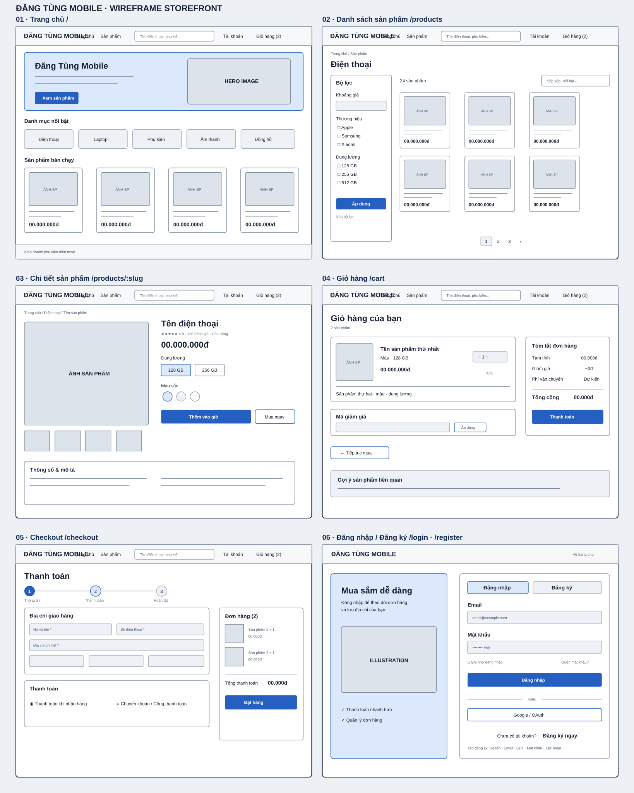
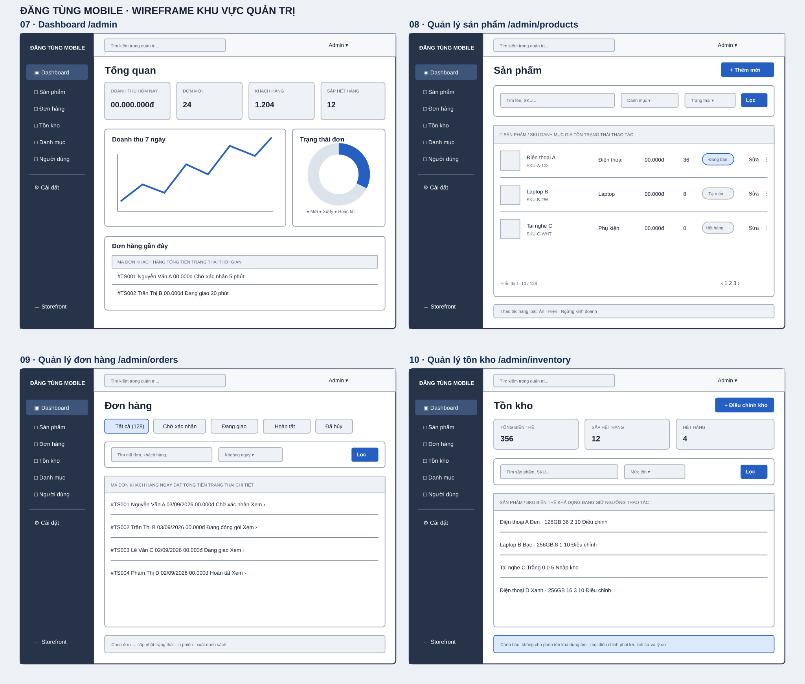
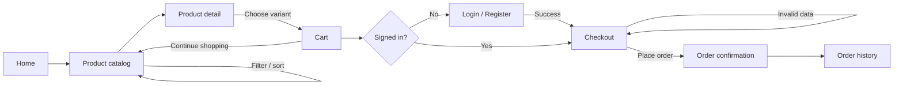
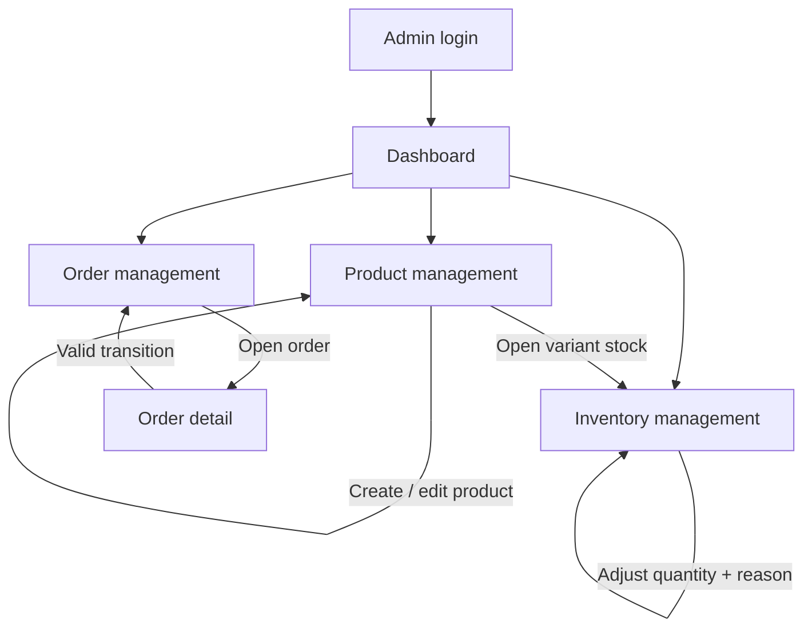

# TechStore main-screen wireframes

These low-fidelity wireframes define information hierarchy, primary actions,
and navigation before visual design and feature implementation. They are not a
final UI specification: colors, typography, images, and exact spacing remain
subject to the shared application theme.

## Wireframe sets

- [Storefront wireframes](storefront.svg): home, catalog with filters, product
  detail, cart, checkout, and login/register.
- [Administration wireframes](admin.svg): dashboard, products, orders, and
  inventory.

Open an SVG directly for the full-resolution version.

## Screen inventory

| ID | Screen | Proposed route | Primary action |
|---|---|---|---|
| 01 | Home | `/` | Discover categories and featured products |
| 02 | Product catalog | `/products` | Filter, sort, and open a product |
| 03 | Product detail | `/products/:slug` | Select a variant and add it to the cart |
| 04 | Cart | `/cart` | Review quantities and continue to checkout |
| 05 | Checkout | `/checkout` | Provide delivery/payment data and place order |
| 06 | Login / Register | `/login`, `/register` | Authenticate or create an account |
| 07 | Admin dashboard | `/admin` | Review operational KPIs and recent orders |
| 08 | Admin products | `/admin/products` | Search, create, edit, and change visibility |
| 09 | Admin orders | `/admin/orders` | Filter orders and update fulfillment status |
| 10 | Admin inventory | `/admin/inventory` | Review stock and record adjustments |

## Storefront purchase flow

## Administration flow

## Interaction notes

### Storefront

- The header keeps product search, account, and cart accessible throughout the
  shopping flow.
- Catalog filters remain visible on desktop. On narrow screens they collapse
  into a filter drawer opened by a clearly labeled button.
- Variant selection is required before adding a product to the cart when more
  than one purchasable variant exists.
- The checkout uses a short three-step indicator: information, payment, and
  completion. The order summary remains visible while editing data on desktop.
- A guest who starts checkout is redirected to login/register and returned to
  checkout after successful authentication.
- Validation errors appear beside the affected field; entered values are not
  cleared after a failed submission.

### Administration

- The sidebar provides stable access to operational modules; the active module
  is visually distinct.
- Lists share the same search, filter, pagination, status, and row-action
  patterns.
- Destructive and status-changing actions require confirmation and clear
  feedback.
- Stock adjustments require a signed quantity and reason, and cannot result in
  negative available inventory.

## Responsive guidance

- Desktop reference width: `1200px` and above.
- Tablet: reduce grid columns and allow horizontal scrolling only inside dense
  administration tables.
- Mobile: stack content vertically, replace the storefront navigation and admin
  sidebar with drawers, and keep the primary action visible near the bottom of
  long forms.
- Touch targets should be at least `44px` high and all controls must have a
  visible text label or accessible name.

## Acceptance-criteria mapping

- `T-00.7.1`: screens 01–06 cover the main storefront and account flow.
- `T-00.7.2`: screens 07–10 cover dashboard, products, orders, and inventory.
- `T-00.7.3`: the two Mermaid diagrams document storefront and administration
  navigation; the storefront diagram covers the purchase flow end to end.
