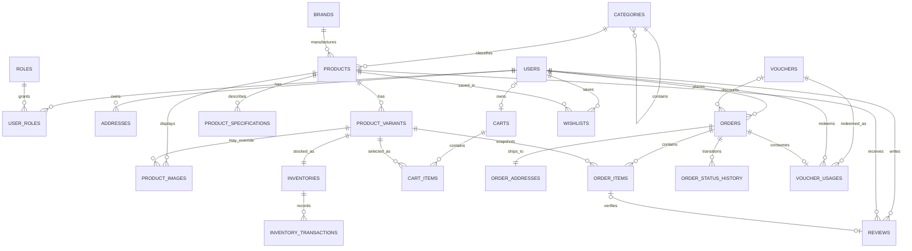

# TechStore Database Design

**Story:** `US-00.3`  
**Tasks:** `T-00.3.1`, `T-00.3.2`, `T-00.3.3`  
**Database:** MySQL 8.0+ (MySQL Server 8.4 supported)

## 1. Domain model

| Domain | Entities | Main rules |
|---|---|---|
| Identity | `users`, `roles`, `user_roles`, `addresses` | Email is unique; users and roles are many-to-many; one default address per user. |
| Catalog | `categories`, `brands`, `products`, `product_variants`, `product_images`, `product_specifications` | Categories are hierarchical; SKU and product slug are unique; product specifications are stored as key/value rows. |
| Inventory | `inventories`, `inventory_transactions` | One inventory row per variant; quantities cannot be negative; every stock change has an auditable transaction. |
| Cart | `carts`, `cart_items` | A cart belongs to a user or guest session; a variant occurs at most once in a cart. |
| Checkout | `vouchers`, `voucher_usages`, `orders`, `order_addresses`, `order_items`, `order_status_history` | Order totals and voucher limits are constrained; order items and shipping addresses are immutable snapshots. |
| Engagement | `reviews`, `wishlists` | A user can review or wishlist a product at most once. |

## 2. ERD



## 3. Keys and cardinality

- Every table has a primary key. Pure many-to-many relation `user_roles` uses the composite key `(user_id, role_id)`.
- Foreign keys use `CASCADE` only for owned child data. Historical commerce data uses `RESTRICT` or `SET NULL` to prevent accidental loss.
- Business identifiers `users.email`, `products.slug`, `product_variants.sku`, `orders.order_number`, and `vouchers.code` are unique.
- Generated helper columns with unique constraints enforce one default address per user and one primary image per product or variant. This is the MySQL-compatible equivalent of a partial unique index.
- Junction tables resolve the many-to-many relationships between users and roles, users and wishlist products, and voucher redemption records.

## 4. Third normal form (3NF)

The operational model is in 3NF:

1. Columns contain atomic values; repeating collections are separate rows (images, specifications, cart items and order items).
2. Non-key attributes depend on the whole key. Junction tables contain relationship-specific data only.
3. Brand, category, role, address, inventory and voucher facts are stored once rather than copied between operational tables.

`order_items` and `order_addresses` intentionally contain snapshots. This is controlled historical denormalization: an order must retain the product name, SKU, paid price and shipping address that were valid when it was placed.

## 5. Integrity and concurrency

- Monetary values use `NUMERIC(15,2)` and explicit non-negative checks.
- `inventories.version` supports optimistic locking; the application must update stock atomically and write an `inventory_transactions` row in the same database transaction.
- `quantity_reserved <= quantity_on_hand` prevents over-reservation at database level.
- Order line totals and order grand totals are checked by constraints.
- Voucher validity dates, percentage bounds and global usage counts are constrained. Per-user limits are enforced transactionally by the service using `voucher_usages`.
- Status transition rules are enforced by the service and audited in `order_status_history`.

## 6. Initialization

Run the schema with MySQL 8.0+ from PowerShell:

```powershell
& "C:\Program Files\MySQL\MySQL Server 8.4\bin\mysql.exe" `
  --user=root --password `
  --execute="source techstore-new/docs/database_schema.sql"
```

The script creates the `techstore` database with `utf8mb4`, all InnoDB tables, constraints and indexes, then seeds the `CUSTOMER`/`ADMIN` roles and basic categories/brands. It is intended for a new database; use versioned migrations for later schema changes.

## 7. Naming conventions

- SQL identifiers use lowercase `snake_case` and plural table names.
- Primary keys use `id`; foreign keys use `<entity>_id`.
- Timestamps use MySQL `TIMESTAMP`; the application and database connection must use UTC (`time_zone='+00:00'`).
- Passwords are never stored as plain text; only `password_hash` is persisted.
